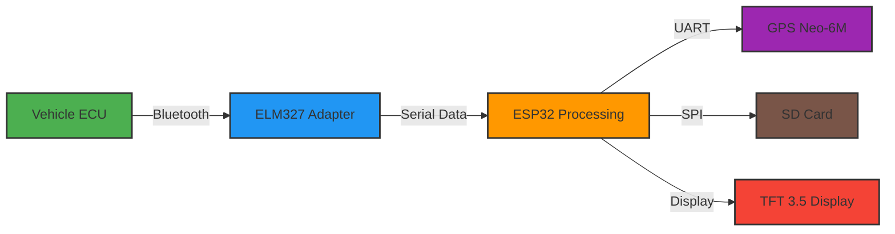

#  OBD-II Telemetry System | Freelander 2 Diesel

<div align="center">

**Real-time automotive telemetry with ESP32 + Bluetooth OBD-II + GPS**

[](https://www.espressif.com/)
[](https://isocpp.org/)
[](https://www.arduino.cc/)
[](https://en.wikipedia.org/wiki/OBD-II)

</div>

---

##  Overview

Sistema de telemetria automotiva desenvolvido para monitoramento em tempo real do **Land Rover Freelander 2 Diesel**. A solução integra comunicação Bluetooth com adaptador ELM327, módulo GPS Neo-6M e interface gráfica TFT, proporcionando acompanhamento preciso de parâmetros críticos do motor.

###  Destaques do Projeto
-  **100% Open Source** - Código documentado e modular
-  **Baixo Custo** - Hardware acessível (< $50 USD)
-  **Plug & Play** - Conexão via porta OBD-II padrão
-  **Data Logging** - Gravação em SD card para análise posterior
-  **Recuperação Automática** - Watchdog e reconexão Bluetooth

---

##  Instalação no Veículo

<div align="center">

**Sistema instalado e operacional no Freelander 2**


*Display integrado ao console com visualização de RPM, pressão do turbo, temperatura e voltagem*

</div>

---

## 🔧 Funcionalidades

### ** Leitura de PIDs SAE J1979**

| Parâmetro | PID | Descrição |
|-----------|-----|-----------|
|  RPM do Motor | `010C` | Rotações por minuto do motor |
| ️ Pressão Turbo/MAP | `010B` | Pressão absoluta do coletor |
|  Velocidade do Veículo | `010D` | Velocidade em km/h |
| ️ Temperatura do Motor | `0105` | Temperatura do líquido de arrefecimento |
|  Nível de Combustível | `012F` | Percentual no tanque |
|  Voltagem da Bateria | `ATRV` | Tensão do sistema elétrico |

### ** Integração GPS (Neo-6M)**
-  Coordenadas geográficas (Lat/Long)
-  Timestamp preciso por satélite
-  Velocidade via GPS (backup)
-  Log de rotas

### ** Interface Gráfica**
- Display TFT 3.5" touchscreen (ESP32 CYD)
- Layout 3x2 com atualização em tempo real
- Cores contextuais por parâmetro
- Indicadores visuais de alerta

### ** Robustez**
- Reconexão automática Bluetooth em caso de perda
- Watchdog timer para recovery do sistema
- Buffer de dados em SD card (1GB)
- Tratamento de erros OBD-II

---

##  Hardware Utilizado

### **Componentes Principais**

| Componente | Modelo | Função |
|------------|--------|--------|
| **Microcontrolador** | ESP32-2432S028R (CYD) | Processamento + Display |
| **Comunicação OBD** | ELM327 Bluetooth | Interface com ECU do veículo |
| **GPS** | Neo-6M | Localização e timestamp |
| **Armazenamento** | SD Card 1GB | Data logging |
| **Display** | TFT 3.5" 480x320 | Interface visual |

### **Conexões**
- **ESP32 ↔ ELM327:** Bluetooth Serial (HC-05/HC-06)
- **ESP32 ↔ GPS:** UART (TX/RX)
- **ESP32 ↔ SD:** SPI

---

##  Especificações Técnicas

| Parâmetro | Valor |
|-----------|-------|
| **Tensão de Alimentação** | 5V (USB/SD Card slot) |
| **Consumo Médio** | ~200mA |
| **Display** | 3.5" TFT LCD 480x320 |
| **Comunicação** | Bluetooth 2.0 + UART |
| **Update Rate** | 1-2 Hz (configurável) |
| **Temperatura Operação** | -20°C a +85°C |

---

##  Como Funciona
##  Como Funciona



##  Instalação e Configuração

### **Pré-requisitos**
- Arduino IDE instalado
- Board ESP32 configurada
- Bibliotecas necessárias (veja `platformio.ini` ou `libraries.txt`)

### **Passo a Passo**

1. **Clone o repositório**
   ```bash
   git clone https://github.com/ProfSergiao/OBD-II-Telemetry-Freelander2.git
2. Instale as bibliotecas
    -TFT_eSPI
    -TinyGPSPlus
    -SD
    -BluetoothSerial
3 .Configure o projeto
    -Edite config.h com seus parâmetros (baud rate, pins, etc.)
    -Ajuste o pareamento Bluetooth do ELM327
4. Compile e faça upload
   # Via Arduino IDE: Sketch → Upload
   # Ou via PlatformIO: pio run --target upload
5. Conecte no veículo
    -Plugue o ELM327 na porta OBD-II (geralmente abaixo do volante)
    -Ligue a ignição
    - O sistema iniciará automaticamente!
## 📄 License

MIT License - free for personal and commercial use
